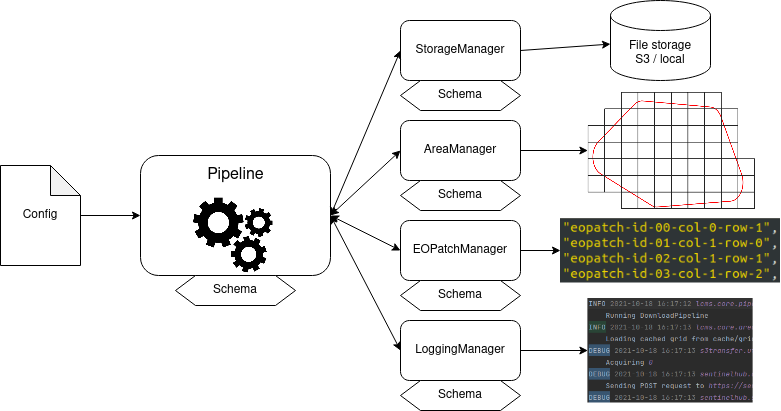

[](https://pypi.org/project/eo-grow)
[](https://pypi.org/project/eo-grow)
[](https://github.com/sentinel-hub/eo-grow/actions)
[](https://eo-grow.readthedocs.io/en/latest/)
[](https://github.com/sentinel-hub/eo-grow/blob/master/LICENSE)
[](https://pepy.tech/project/eo-grow)
[](https://pepy.tech/project/eo-grow)
[](https://codecov.io/gh/sentinel-hub/eo-grow)

# eo-grow
**Earth observation framework for scaled-up processing in Python.**

Analyzing Earth Observation (EO) data is complex and solutions often require custom tailored algorithms. In the EO domain most problems come with an additional challenge: *How do we apply the solution on a larger scale?*

Working with EO data is made easy by the [`eo-learn`](https://github.com/sentinel-hub/eo-learn) package, while the **`eo-grow`** package takes care of running the solutions at a large scale. In **`eo-grow`** an `EOWorkflow` based solution is wrapped in a **pipeline** object, which takes care of parametrization, logging, storage, multi-processing, EOPatch management and more. However, **pipelines** are not necessarily bound to `EOWorkflow` execution and can be used for other tasks such as training ML models.

Features of **`eo-grow`** include:
- Direct use of `EOWorkflow` procedures.
- Parametrizing workflows by using validated configuration files, making executions easy to reproduce and adjust.
- Easy use of both local and AWS S3 storage with no required code adaptation.
- Splitting large areas of interest into grids and defining collections of EOPatches.
- Workflows can be run either single-process, multi-process, or even on multiple machines (by using `ray` clusters).
- Execution reports and customizable logging.
- Options for skipping already processed data when re-running a pipeline.
- Offers a CLI interface for running pipelines, validating configuration files, and generating templates.
- A collection of basic pipelines, with methods that can be overridden to tailor to a large amount of use-cases.


## General Structure Overview

The core object of **`eo-grow`** is the `Pipeline`. Each pipeline has a `run_procedure` method, which is executed after the pipeline is set up. By default, the `run_procedure` executes an `EOWorkflow` which is built by the (user-defined) `build_workflow` method.

Each pipeline is linked to so called *managers*:
- `StorageManager` handles loading and saving of files,
- `AreaManager` defines the area of interest and how it should be split into EOPatches,
- `LoggingManager` provides control over logging.



Managers and pipelines usually require a large amount of parameters (setting storage paths, configuring log parameters, etc.), which are provided in `.json` configuration files. Each **`eo-grow`** object contains a special `Schema` class, which is a `pydantic` model describing the parameters of the object. Config files are then validated before execution to catch issues early. Templates for config files can be generated with the `eogrow-template` CLI command.

To make config files easier to write **`eo-grow`** uses a simple [config language](https://github.com/sentinel-hub/eo-grow/tree/main/docs/source/config-language.md) that supports importing other configs, variables, and more.


## Install

### PyPi distribution

The **`eo-grow`** package requires Python version `>= 3.8` and can be installed with

```
pip install eo-grow
```


## Command Line Interface

Running pipelines is easiest by using the CLI provided by **`eo-grow`**. For all options use the `--help` flag with each command.

- `eogrow <config>` executes the pipeline defined in the `<config>` file.
- `eogrow-validate <config>` only performs validation of the `<config>` file.
- `eogrow-test <config>` initializes the pipeline/object but does not run it. Useful for testing if managers are set correctly or for generating area-split grids.
- `eogrow-ray <cluster> <config>` executes the pipeline defined in `<config>` on the active Ray cluster defined by the `<cluster>` file.
- `eogrow-template <import path> <template>` generates a template config for the object specified by the `<import path>` and saves it to the `<template>` file (or outputs it directly if `<template>` is not provided).

## Documentation

For more information on the package visit [readthedocs](https://eo-grow.readthedocs.io/en/latest/).

Explanatory examples can be found [here](https://github.com/sentinel-hub/eo-grow/tree/main/examples).

More details on the config language used by **`eo-grow`** can be found [here](https://github.com/sentinel-hub/eo-grow/tree/main/docs/source/config-language.md).


## Questions and Issues

Feel free to ask questions about the package and its use cases at [Sentinel Hub forum](https://forum.sentinel-hub.com/) or raise an issue on [GitHub](https://github.com/sentinel-hub/eo-grow/issues).


## License

See [LICENSE](https://github.com/sentinel-hub/eo-grow/blob/main/LICENSE).

## Acknowledgements

This project has received funding from the European Union’s Horizon 2020 research and innovation programme under Grant Agreement No. 101004112.
