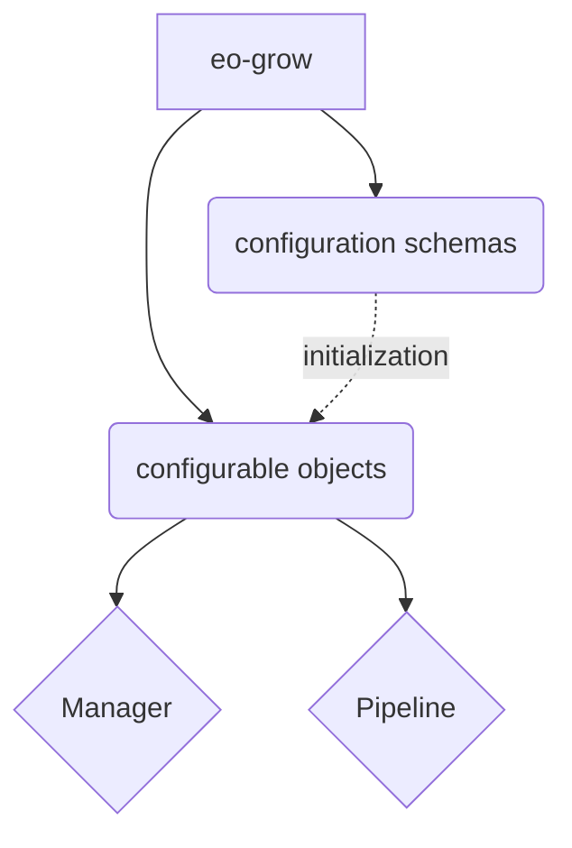
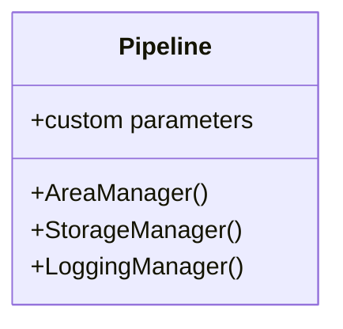

# High level overview

The two main categories of `eo-grow` building blocks are:

- configurable objects (subclasses of `EOGrowObject`)
- configuration schemas (subclasses of `EOGrowObject.Schema`)

Each `EOGrowObject` is initialized with a `Schema` object. The `Schema` is saved to the object as an attribute `config: Schema` which stores the configuration information.

The configurable objects can be further separated into instances of:

- `Manager`, a helper class with a limited scope.
- `Pipeline`, a class for execution

Here is the overview so far



`Manager` classes are used to build configurations for specific aspects of the pipeline, such as area, storage, or logging, while the `Pipeline` class accepts the full configuration (pipeline specific + all managers) and contains methods of execution.



Building a custom object as a subclass of `EOGrowObject` is straighforward, you only need to provide a suitable nested subclass of `EOGrowObject.Schema`, which must always be named `Schema`. For example, a subclass of `Pipeline` should contain a nested subclass of `Pipeline.Schema`, as shown below.

```python
# example of how to write a custom pipeline
class MyPipeline(Pipeline):

    class Schema(Pipeline.Schema):
        extra_field: str = "beep"
        ...

    # this line informs type-checkers that the type of `config` is no longer `Pipeline.Schema`
    # but it is now `MyPipeline.Schema`
    config: Schema

    def custom_method():
        ...
    ...
```

## Schemas

The `Schema` is in general a [`pydantic` model](https://docs.pydantic.dev/usage/models/), but with some project specific constrains and additions. It is best to always inherit from `EOGrowObject.Schema` to ensure a suitable pydantic configuration of the models.

The `EOGrow.Schema` model:

- rejects any additional parameters that are not listed,
- does not allow mutation,
- validates default values.

In case you are inheriting from a `Manger` or a `Pipeline` class, it is heavily advised to let `Schema` be a subclass of the superclass schema (type-checkers should warn you about it).

### Validators

You can use any kind of [`pydantic` validators](https://docs.pydantic.dev/usage/validators/) to verify the data in your schema. You can find some existing utility functions in `eogrow.utils.validators`:

- `field_validator` / `optional_field_validator` for wrapping callables defined elsewhere,
- `ensure_exactly_one_defined` and `ensure_defined_together` for linking together parameters that can be `None`,
- `ensure_storage_key_presence` for checking that storage keys are defined in the storage manager (see section on [managers](#managers)),
- `restrict_types` to restrict which feature types are allowed on a field that defines a feature.

Root validators can also be used, but are discouraged in the main `eo-grow` repository as they clutter the documentation pages.

For example, a storage key presence could be validated in the following way:

```python
class Schema(Pipeline.Schema):
    folder_key: str = "check_if_i_exist"
    _check_folder_key_presence = ensure_storage_key_presence("folder_key")
```

### Parsers

Certain types do not provide direct parsing capabilities (for instance `numpy.dtype` or `datetime`). In such cases you can use **pre-validators**, which means that the validator will be applied before `pydantic` checks that the type is right (check [here](https://docs.pydantic.dev/usage/validators/#pre-and-per-item-validators) for more info). This is done by setting the `pre` flag of validators to `True`. The `field_validator` and `optional_field_validator` utilities also allow this setting, so you can do:

```python
from typing import Optional
import numpy as np
from eogrow.core.schemas import BaseSchema
from eogrow.utils.validators import optional_field_validator, parse_dtype

class MyModel(BaseSchema):
    maybe_dtype: Optional[np.dtype]
    _parse_maybe_dtype = optional_field_validator("maybe_dtype", parse_dtype, pre=True)
```

Other predefined parsers are and `parse_time_period` and `parse_data_collection`.

## Managers

Managers are helper-classes of pipelines that focus on a single role.

### Storage Manager

Takes care of managing data storage and works both with local storage and Amazon S3.

### Area Manager

### Logging Manager

## Pipelines
